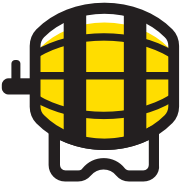

<div align="center">
  
</div>
<h1 align="center">brewski</h1>
<div align="center">
  <strong>A artisan web microframework</strong>
</div>
<br>
<div align="center">
  <a href="https://npmjs.org/package/brewski">
    
  </a>
  <a href="https://npmjs.org/package/brewski">
  
  </a>
  <a href="https://github.com/feross/standard">
    
  </a>
  <a href="https://github.com/prettier/prettier">
    
  </a>
  <a href="https://travis-ci.org/tiaanduplessis/brewski">
    
  </a>
  <a href="https://github.com/tiaanduplessis/brewski/blob/master/LICENSE">
    
  </a>
  <a href="http://makeapullrequest.com">
    
  </a>
</div>
<br>
<div align="center">
  <a href="https://github.com/tiaanduplessis/brewski/watchers">
    
  </a>
  <a href="https://github.com/tiaanduplessis/brewski/stargazers">
    
  </a>
  <a href="https://twitter.com/intent/tweet?text=Check%20out%20brewski!%20https://github.com/tiaanduplessis/brewski%20%F0%9F%91%8D">
    
  </a>
</div>
<br>
<div align="center">
  Built with ❤︎ by <a href="https://github.com/tiaanduplessis">tiaanduplessis</a> and <a href="https://github.com/tiaanduplessis/brewski/contributors">contributors</a>
</div>

<h2>Table of Contents</h2>
<details>
  <summary>Table of Contents</summary>
  <li><a href="#about">About</a></li>
  <li><a href="#features">Features</a></li>
  <li><a href="#install">Install</a></li>
  <li><a href="#usage">Usage</a></li>
  <li><a href="#api">API</a></li>
  <li><a href="#benchmark">Benchmark</a></li>
  <li><a href="#node">Acknowledgements</a></li>
  <li><a href="#contribute">Contribute</a></li>
  <li><a href="#license">License</a></li>
</details>

## About

Brewski is a tiny node framework that assists in the creation of performant APIs when other options feel like overkill.

## Features

- Fast: being perfomant is a [must](#benchmark)
- Extendible: supports [express](https://www.npmjs.com/package/express) style middleware
- Logging: build in [logger](https://github.com/pinojs/pino)
- Environment Management: simple handling of enviroment variables with [envobj](https://github.com/matthewmueller/envobj)
- Chainable: API is completely chainable

## Install

```sh
$ npm install brewski
# OR
$ yarn add brewski
```

## Usage

```js
const brewski = require('brewski')

const app = brewski()
const { log, env } = app

app.get('/test', (req, res) => {
  log.info('Request to /test')
  res.send(200, { test: true })
})

app.get('/:name', (req, res) => {
  res.send(200, { name: req.params.name })
})

app.get('/baz', (req, res) => {
  res.send(200, { name: req.query.name })
})

app.listen(app.env.PORT)
```

## API

### `brewski(options): Object`

Creates and returns a new `brewski` object.

Options include: 

- `logLevel`: String - Level of logging for [pino](https://github.com/pinojs/pino) logger. Defaults to `info`.
- `logStream`: Stream - Stream to log to. Defaults to `process.stdout`.
- `env`: Object - Environment variables to pass to [envobj](https://github.com/matthewmueller/envobj).
- `https`: Object - Configuration options if https server should be created. Uses same options as [`http.createServer`](https://nodejs.org/api/https.html#https_https_createserver_options_requestlistener)
- `defaultHandler`: function - Function to handle act as default route e.g.:
  ```js
  function defaultHandler(req, res) {
    res.statusCode = 404
    res.end()
  }
  ```

Example:

```js
const brewski = require('brewski')
const api = brewski({
  logLevel: 'fatal',
  env: {
    port: 3000
  }
})
```

### `brewski.use(middleware: Function): Object`

Add new middleware to the stack. Middleware is processed in the order they are added. Since the middleware function matches that of express, existing packages can be used with no additional configuration:

```js
const brewski = require('brewski')
const api = brewski()

const helmet = require('helmet')

api.use(helmet())

```

### `brewski.route(method: String|Array, route: String, handler: Function)`

Creates a new route. Brewski uses [find-my-way](https://github.com/delvedor/find-my-way) to handle routing and supports parametric, wildcard and parametric with regex routes e.g: 

```js

const brewski = require('brewski')
const api = brewski()

api.get('/foo/:baz', (req, res) => {
  res.send(req.params)
})

api.get('/baz/*', (req, res) => {
  res.send(req.params)
})

api.get('/baz/:thing(^\\d+).png', (req, res) => {
  res.send(req.params)
})

```

#### Shorthand Methods

You can also use the shorthand methods to declare your routes e.g:

```js

const brewski = require('brewski')
const api = brewski()

function handler(req, res) {
  res.send({success: true})
}

api.get('/foo', handler)
api.post('/foo', handler)
api.patch('/foo', handler)
api.delete('/foo', handler)
api.head('/foo', handler)
api.put('/foo', handler)
api.option('/foo', handler)

api
  .get('/baz', handler)
  .post('/baz', handler)
```

### `brewski.server`

Access to the HTTP server instance created by brewski. See [node docs](https://nodejs.org/dist/latest-v8.x/docs/api/) for more information.

### `brewski.listen(port, address, callback)`

Starts the created server on provided port and address. If port is not provided, `env.PORT` is used. `callback` is called after server starts listening.

Example:

```js
const brewski = require('brewski')
const api = brewski()

api.listen()
// api.listen(3000)
// api.listen(3000, () => console.log('Listening on port 3000'))
```

### `brewski.log`

Provides access to the [pino](https://github.com/pinojs/pino) logger instance e.g:

```js

const brewski = require('brewski')
const api = brewski()

api.log.info({foo: true})
```

See [pino](https://github.com/pinojs/pino) documentation for more options.

### `brewski.env`

Provides access to [envobj](https://github.com/matthewmueller/envobj) object.

## Benchmark

Benchmark is run using [autocannon](https://github.com/mcollina/autocannon) with 200 concurrent connection for 30s. To run the benchmark:

```sh
npm i && npm run benchmark:
# Or
yarn && yarn benchmark
```

Results from latest benchmark (MacBook Pro (Mid 2015), 2,2 GHz Intel Core i7, 16 GB 1600 MHz DDR3):

```
Stat         Avg      Stdev   Max
Latency (ms) 15.33    4.95    206
Req/Sec      12717.34 1769.16 13551
Bytes/Sec    1.84 MB  257 kB  1.97 MB

381k requests in 30s, 55.3 MB read
Done in 30.71s.
```

## Acknowledgements

This package is inspired and influenced by [fastify](https://github.com/fastify/fastify). 

## Contributing

Contributions are welcome!

1. Fork it.
2. Create your feature branch: `git checkout -b my-new-feature`
3. Commit your changes: `git commit -am 'Add some feature'`
4. Push to the branch: `git push origin my-new-feature`
5. Submit a pull request :D

Or open up [a issue](https://github.com/tiaanduplessis/brewski/issues).

## License

Licensed under the MIT License.
